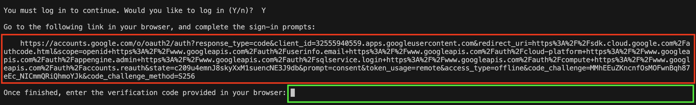
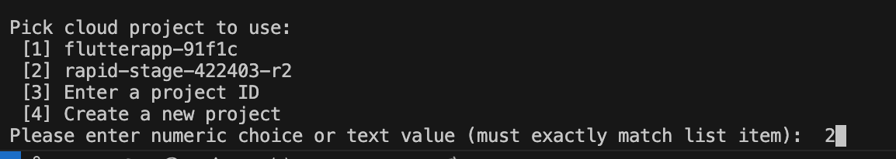
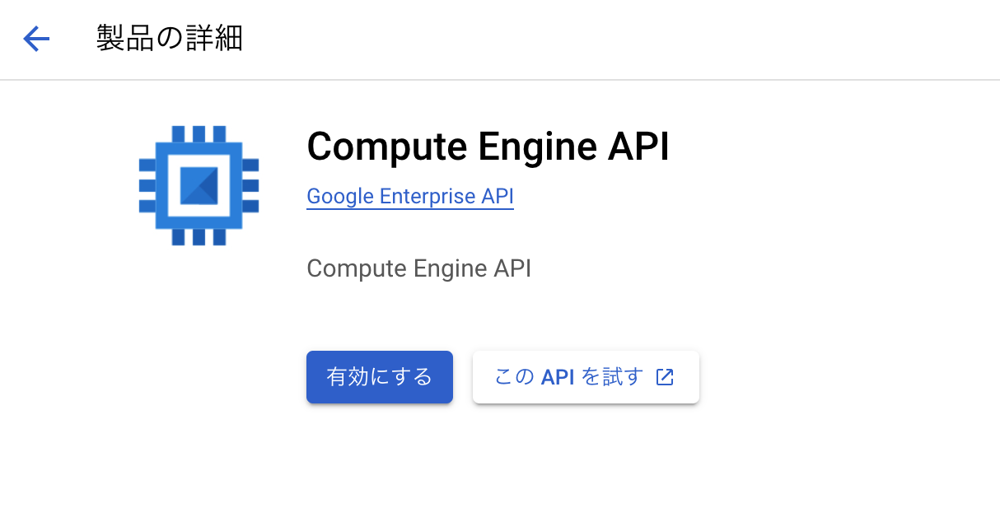
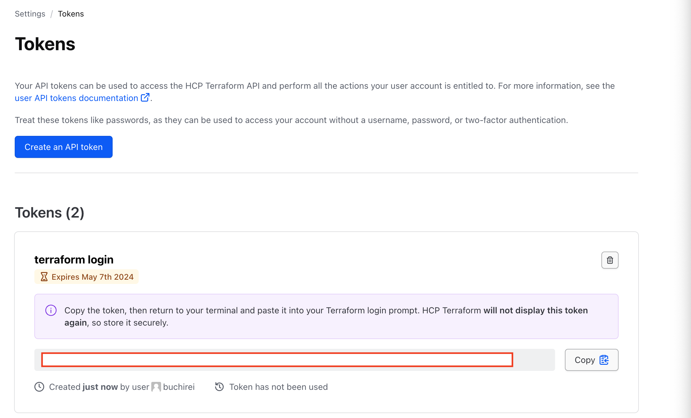

# Kuchikomi-Navi

## 共通
devcontaienr間（backent - frontend）で通信するためにnetworkを作成
```
docker network create kuchikomi-network
```

## backend
### セットアップ
```
cd backend
(vs code上で) Rebuid and Reopen in Containerを実行 
rails db:create
```

### 起動
```
(container内で) rails s -b "0.0.0.0"
```

### API定義の出力
```
rails spec
（↑のコマンドがpassしたら） rails rswag:specs:swaggerize
```
上記コマンド実行後、[http://localhost:3000/api-docs](http://localhost:3000/api-docs)へアクセス

### rspecのデバッグ方法
デバッグしたい箇所に`binding.break`を記述し、
以下のコマンドを実行するとterminalにdebug consoleが表示される
```
rspec /path/to/test_spec.rb
```


## frontend
### yamlファイルからAPIの型定義を作成
```
yarn generate
```

## infra
### gcloudの初期化
コンテナの初回起動時に自動でgcloudの初期化が実行される<br>
赤枠内に表示されているURLをブラウザで開き、ログインを行う<br>
最後に表示された確認コードを緑の枠に入力する

確認コードを入力後に、利用するprojectを選択する


### Compute Engine APIを有効化する
有効化されるまでに数分かかります


### tfstateファイルをTerraform Cloudに保存するために以下からアカウントを作成
https://app.terraform.io/public/signup/account

### terraform CLIで利用するtokenを設定
コンテナの初回起動時に自動でterraformの初期化が実行される<br>
以下に表示されるtokenをコピーし、terminalに貼り付ける<br>


### Terraform Cloud経由でデプロイするためにGCPの認証情報を設定
gcloud初期化後に、`/root/.config/gcloud/application_default_credentials.json`に認証情報が保存されている<br>
Terraform Cloud経由でデプロイするためには、上記の情報が必要なため、下記のように登録する。<br>
必ず、<b>Sensitiveにはチェックを入れる</b>
| key | value |
| --- | ----- |
| gcp-creds | application_default_credentials.jsonの中身 |
