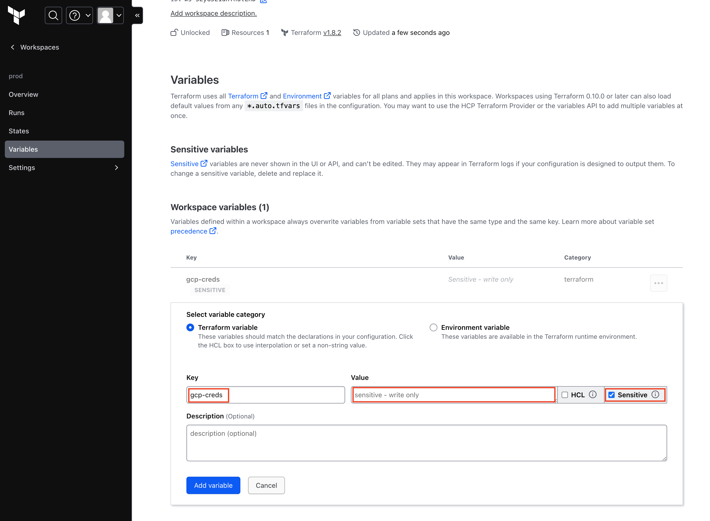

# Kuchikomi-Navi

## 共通

devcontaienr 間（backent - frontend）で通信するために network を作成

```
docker network create kuchikomi-network
```

## backend

### セットアップ

```
cd backend
(vs code上で) Rebuid and Reopen in Containerを実行
bin/rails db:create
```

### 起動

```
(container内で) bin/rails s -b "0.0.0.0"
```

### 新規コントローラーの作成

例えば、stores_controller を作成したい場合は以下

```
bin/rails generate controller Stores index --skip-routes
```

### モデルの作成

例えば、string 型の title と、text 型の body をフィールドに持つ Article モデルを作成したい場合

```
bin/rails generate model Article title:string body:text
```

上記コマンド成功後に以下のコマンドを実行すると migration される

```
bin/rails db:migrate
```

### モデルに注釈をつけたい場合

```
annotate --models
```

### マイグレーションの作成

```
bin/rails generate migration AddPartNumberToProducts
```

### マイグレーションのロールバック

```
bin/rails db:migrate:status
（↑で表示されたMigration IDの中からロールバックしたい箇所のIDを指定） bin/rails db:migrate:down VERSION=${Migration ID}
```

### 新規 Job の作成

例えば、stores_controller を作成したい場合は以下

```
bin/rails generate job guests_cleanup
```

### Job の登録

[参照](https://github.com/sidekiq/sidekiq/wiki/Getting-Started)

### sidekiq の起動

```
bundle exec sidekiq
```

### API 定義の出力

```
bin/rails spec
（↑のコマンドがpassしたら） bin/rails rswag:specs:swaggerize
```

上記コマンド実行後、[http://localhost:3000/api-docs](http://localhost:3000/api-docs)へアクセス

### rspec のデバッグ方法

デバッグしたい箇所に`binding.break`を記述し、
以下のコマンドを実行すると terminal に debug console が表示される

```
rspec /path/to/test_spec.rb
```

## frontend

### yaml ファイルから API の型定義を作成

```
pnpm generate
```

## infra

### GCP のアカウントを作成

最初に GCP のアカウントを作成する

### gcloud の初期化

コンテナの初回起動時に自動で gcloud の初期化が実行される<br>
赤枠内に表示されている URL をブラウザで開き、ログインを行う<br>
最後に表示された確認コードを緑の枠に入力する

確認コードを入力後に、利用する project を選択する


### 使用するサービスの API を有効化するために以下のコマンドを時効

```
./enableapi.sh
```

### tfstate ファイルを Terraform Cloud に保存するために以下からアカウントを作成

https://app.terraform.io/public/signup/account

### terraform CLI で利用する token を設定

コンテナの初回起動時に自動で terraform の初期化が実行される<br>
以下に表示される token をコピーし、terminal に貼り付ける<br>


### Terraform Cloud 経由でデプロイするために GCP の認証情報を設定

gcloud 初期化後に、`/root/.config/gcloud/application_default_credentials.json`に認証情報が保存されている<br>
Terraform Cloud 経由でデプロイするためには、上記の情報が必要なため、下記のように登録する。<br>
必ず、<b>Sensitive にはチェックを入れる</b>
| key | value |
| --- | ----- |
| gcp-creds | application_default_credentials.json の中身 |


### Cloud Build 経由で Cloud Run へ deploy するために、pat を設定

[PAT を作成](https://cloud.google.com/build/docs/automating-builds/github/connect-repo-github?hl=ja&generation=2nd-gen#connecting_a_github_host_programmatically:~:text=%E3%82%A4%E3%83%B3%E3%82%B9%E3%83%88%E3%83%BC%E3%83%AB%E3%81%97%E3%81%BE%E3%81%99%E3%80%82-,%E5%80%8B%E4%BA%BA%E7%94%A8%E3%81%AE,%E3%81%A6%E3%81%8F%E3%81%A0%E3%81%95%E3%81%84%E3%80%82,-%E5%80%8B%E4%BA%BA%E7%94%A8%E3%81%AE)し、以下のように登録する
| key | value |
| --- | ----- |
| gh-token | <PAT> |


### リソースのデプロイ

```
./apply.sh
```

### リソースの削除

```
terraform destroy
```

### 既存のリソースを tf ファイルに出力

```
gcloud beta resource-config bulk-export --resource-format=terraform > infla.tf
```

## lhci

### lhci のセットアップ

lhci で以下の画面が表示される（セットアップ前の場合）はローカルで`lhci wizard`を実行


```
root@118c639484c8:/usr/src/app/lhci# npx lhci wizard
? Which wizard do you want to run? new-project
? What is the URL of your LHCI server? https://lhci-server-xxxxxxxxx-de.a.run.app
? What would you like to name the project? Kuchikomi-Navi
? Where is the project's code hosted? https://github.com/rei1011/Kuchikomi-Navi
? What branch is considered the repo's trunk or main branch? main
Created project Kuchikomi-Navi (d834d15e-ee59-48e6-b5c0-8de52a509c1c)!
Use build token xxxxxxxx-xxxx-xxxx-xxxx-xxxxxxxxxxxx to add data.
Use admin token xxxxxxxxxxxxxxxxxxxxxxxxxxxxxxxxxxxxxxxx to manage data. KEEP THIS SECRET!
```

build token を CircleCI の環境変数に`LHCI_TOKEN`として登録
